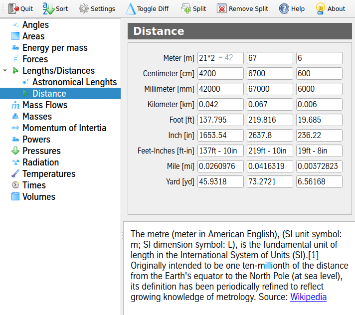

# Unit Conversion Tool

Convert to all configured units in one unit group while typing.

In order to configure, add or remove units edit the units.xml in the bin
directory. Unit groups may contain two or more units. Each unit has to
be set to one of the types:

* factor: Multiply by a defined value
* transform: Calculate by given fromSI/toSI formula
* formatted: formatted input of unit

All units may be given a info section to supply further mathematical
background information to the specific unit.
